<p align="center">
  
</p>

<p align="center">
  
</p>

<h1 align="center">claude-app-mirror</h1>

<p align="center">
  Mirror the official Claude desktop app installers into GitHub Releases.
</p>

<p align="center">
  <a href="https://github.com/Wangnov/claude-app-mirror/releases/latest"></a>
  <a href="https://github.com/Wangnov/claude-app-mirror/releases/latest"></a>
  <a href="https://github.com/Wangnov/claude-app-mirror/actions/workflows/mirror.yml"></a>
  <a href="https://github.com/Wangnov/claude-app-mirror/actions/workflows/mirror.yml"></a>
  <a href="https://github.com/Wangnov/claude-app-mirror/releases/latest"></a>
  <a href="https://github.com/Wangnov/claude-app-mirror/releases/latest"></a>
  <a href="https://github.com/Wangnov/claude-app-mirror/releases/latest"></a>
  <a href="https://linux.do/"></a>
  <a href="./LICENSE"></a>
</p>

<p align="center">
  GitHub Release · Cloudflare R2 short links · macOS DMG · Windows MSIX · Linux deb · checksums · release manifest
</p>

<p align="center">
  <a href="#readme-cn">中文</a> · <a href="#readme-en">English</a>
</p>

---

<a id="readme-cn"></a>

# 中文

有时候你只是想下载 Claude 桌面应用的安装包，但官方链路在国内不配合：更新接口 `api.anthropic.com` 与安装包托管的 Google Cloud Storage（`downloads.claude.ai`）在中国大陆经常被墙或限速，导致下载缓慢、失败。

`claude-app-mirror` 做的事情很窄：它不构建、不修改、不重打包 Claude，只把官方当前的桌面安装包拉下来，按版本探测结果发布到 GitHub Release，并同步一份到 Cloudflare R2 短链供国内下载。

## 镜像内容

- macOS 通用包（Apple Silicon + Intel）：`Claude-mac-universal.dmg`
- Windows x64：`Claude-win-x64.msix`
- Windows arm64：`Claude-win-arm64.msix`
- Linux x64：`Claude-linux-x64.deb`
- Linux arm64：`Claude-linux-arm64.deb`
- `SHA256SUMS.txt`：本次 Release 内所有资产的校验和
- `release-manifest.json`：本次探测到的上游指纹（版本、URL、内容哈希、大小）

## 为什么镜像 MSIX 而不是官网那个 `.exe`

官网 Windows 下载按钮给的 `ClaudeSetup.exe`（约 7MB）并不是自包含安装包，而是一个 **在线引导器**：运行时它会再去 `downloads.claude.ai`（GCS）下载真正的 ~220MB MSIX 再本地安装，且下载基址写死在已签名二进制里、会校验签名，无法重定向到镜像。所以镜像这个 exe 对国内场景没有意义。本项目改为直接镜像 **自包含、可离线安装** 的 `.msix`（Windows）与 `.dmg`（macOS）。

## 关于 Linux

官方 Linux 桌面端目前处于 beta 阶段，提供 `.deb` 安装包（x64 与 arm64），适用于 Ubuntu 22.04 及以上、Debian 12 及以上，本项目一并镜像。官方文档见 [Claude Desktop on Linux (beta)](https://code.claude.com/docs/en/desktop-linux)。

Linux 版不会自更新。官方的升级方式是通过 Anthropic 的 apt 源，这个源同样托管在 `downloads.claude.ai`，国内经常无法访问或被限速，本项目不代理它。按官方文档，安装 `.deb` 时会同时注册这个 apt 源。如果不想在 `apt update` 时看到该源的连接错误，可以在安装前创建 `/etc/default/claude-desktop`，写入一行 `CLAUDE_DESKTOP_ADD_REPO="false"`。之后有新版本时，回到本镜像下载新的 `.deb` 重新安装即可。

## 版本号说明

macOS、Windows 与 Linux 当前来自同一发布、版本号锁步一致（例如 `2.9939.4`）。Release tag 形如：

```text
claude-app-v2.9939.4
```

版本号取自官方更新接口返回的 `currentRelease`，与安装包路径中的版本段一致。

## 怎么用

打开 [最新 GitHub Release](https://github.com/Wangnov/claude-app-mirror/releases/latest)，下载你的平台对应文件：

- macOS：`Claude-mac-universal.dmg`
- Windows x64：`Claude-win-x64.msix`
- Windows arm64：`Claude-win-arm64.msix`
- Linux x64：`Claude-linux-x64.deb`
- Linux arm64：`Claude-linux-arm64.deb`

也可以直接使用 R2 短链接（面向国内网络，只保留最新版）：

- macOS：[https://claudeapp.agentsmirror.com/latest/mac](https://claudeapp.agentsmirror.com/latest/mac)
- Windows x64：[https://claudeapp.agentsmirror.com/latest/win-x64](https://claudeapp.agentsmirror.com/latest/win-x64)
- Windows arm64：[https://claudeapp.agentsmirror.com/latest/win-arm64](https://claudeapp.agentsmirror.com/latest/win-arm64)
- Linux x64：[https://claudeapp.agentsmirror.com/latest/linux-x64](https://claudeapp.agentsmirror.com/latest/linux-x64)
- Linux arm64：[https://claudeapp.agentsmirror.com/latest/linux-arm64](https://claudeapp.agentsmirror.com/latest/linux-arm64)
- 校验和：[https://claudeapp.agentsmirror.com/latest/checksums](https://claudeapp.agentsmirror.com/latest/checksums)

需要旧版本时，请到 [GitHub Releases](https://github.com/Wangnov/claude-app-mirror/releases) 按 tag 查找历史资产。

### 安装

- macOS：打开 `.dmg`，把 Claude 拖进“应用程序”。
- Windows：双击 `.msix`，由“应用安装程序”完成；或 PowerShell `Add-AppxPackage Claude-win-x64.msix`。MSIX 为已签名包，消费版 Windows 10/11 默认允许；锁策略企业机可能需要管理员放行已签名应用的侧载。
- Linux（Ubuntu 22.04+ / Debian 12+）：在下载目录执行 `sudo apt install ./Claude-linux-x64.deb`；arm64 设备使用 `Claude-linux-arm64.deb`。

建议同时下载 `SHA256SUMS.txt` 核对文件完整性。

## 社区

本项目链接并认可 [LINUX DO](https://linux.do/) 社区。欢迎在社区讨论帖中交流下载链路、安装体验、校验结果和改进建议。

## 自动轮询

Cloudflare Cron Worker 每 15 分钟触发一次 GitHub Actions 的 `Mirror Claude Desktop Installers` workflow（仓库内 GitHub `schedule` 每 6 小时作为兜底）。

每次运行先做轻量探测：

- 对五个 `api.anthropic.com/api/desktop/.../latest/redirect` 端点取 307 跳转目标（含版本号与内容哈希）
- 对落地的 `downloads.claude.ai` 产物做 HEAD，读取 `Content-Length`、`ETag`、`Last-Modified`
- 与最新 Release 的 `release-manifest.json` 比对

如果没有变化，workflow 在探测阶段结束，不下载、不发布重复 Release。若发现新版本，则下载五个安装包、生成校验和与 manifest，发布新的 GitHub Release，并同步到 R2。

## 上游来源

- 更新/下载入口（稳定、无需鉴权）：`https://api.anthropic.com/api/desktop/<platform>/<arch>/<format>/latest/redirect`
  - `darwin/universal/dmg`、`win32/x64/msix`、`win32/arm64/msix`、`linux/x64/deb`、`linux/arm64/deb`
- 实际产物托管：`https://downloads.claude.ai/releases/...`（Google Cloud Storage）

## 这个仓库不会做什么

- 不修改 Claude 安装包
- 不重打包、不破解安装器或授权逻辑
- 不镜像官网的 `ClaudeSetup.exe` 在线引导器，也不镜像 Squirrel 增量包（`.nupkg` / 自动更新 `.zip`）
- 不代理 Anthropic 的 Linux apt 源，只镜像直链 `.deb` 安装包
- 不替代 Anthropic 的官方分发渠道

---

<a id="readme-en"></a>

# English

Sometimes you just want to download the Claude desktop app installer, but the official path is unreliable from mainland China: the update API (`api.anthropic.com`) and the Google Cloud Storage host that serves the installers (`downloads.claude.ai`) are frequently blocked or throttled there.

`claude-app-mirror` keeps the job deliberately narrow. It does not build, modify, or repackage Claude. It downloads the current official desktop installers, publishes them as GitHub Release assets when the upstream fingerprints change, and mirrors a copy to Cloudflare R2 short links for users behind a slow link.

## Mirrored assets

- macOS universal (Apple Silicon + Intel): `Claude-mac-universal.dmg`
- Windows x64: `Claude-win-x64.msix`
- Windows arm64: `Claude-win-arm64.msix`
- Linux x64: `Claude-linux-x64.deb`
- Linux arm64: `Claude-linux-arm64.deb`
- `SHA256SUMS.txt` for all assets in the release
- `release-manifest.json` with the upstream fingerprints (version, URL, content hash, size)

## Why MSIX, not the website `.exe`

The official Windows download button serves `ClaudeSetup.exe` (~7MB), which is not a self-contained installer but an **online bootstrapper**: at install time it re-downloads the real ~220MB MSIX from `downloads.claude.ai` (GCS), with the base URL baked into the signed binary and signature-checked, so it cannot be redirected to a mirror. Mirroring that stub is pointless for the slow-link use case. This project mirrors the **self-contained, offline-installable** `.msix` (Windows) and `.dmg` (macOS) instead.

## Linux

Anthropic's official Linux desktop app is in beta and ships as a `.deb` (x64 and arm64) for Ubuntu 22.04+ and Debian 12+. This project mirrors it too. See the official docs: [Claude Desktop on Linux (beta)](https://code.claude.com/docs/en/desktop-linux).

The Linux app does not update itself. Upgrades normally come from Anthropic's apt repository, which is also hosted on `downloads.claude.ai` and is often unreachable or throttled in mainland China, so this project does not proxy it. According to the official docs, installing the `.deb` also registers that apt repository. To avoid connection errors on `apt update`, create `/etc/default/claude-desktop` with the line `CLAUDE_DESKTOP_ADD_REPO="false"` before installing. When a new version ships, download the new `.deb` from this mirror and install it again.

## Version numbers

macOS, Windows and Linux currently come from the same release and share a lock-step version (for example `2.9939.4`). Release tags look like:

```text
claude-app-v2.9939.4
```

The version comes from the official update API's `currentRelease`, matching the version segment in the installer path.

## Usage

Open the [latest GitHub Release](https://github.com/Wangnov/claude-app-mirror/releases/latest) and download the asset for your platform:

- macOS: `Claude-mac-universal.dmg`
- Windows x64: `Claude-win-x64.msix`
- Windows arm64: `Claude-win-arm64.msix`
- Linux x64: `Claude-linux-x64.deb`
- Linux arm64: `Claude-linux-arm64.deb`

You can also use the R2 short links directly (mainland-China-friendly, latest-only):

- macOS: [https://claudeapp.agentsmirror.com/latest/mac](https://claudeapp.agentsmirror.com/latest/mac)
- Windows x64: [https://claudeapp.agentsmirror.com/latest/win-x64](https://claudeapp.agentsmirror.com/latest/win-x64)
- Windows arm64: [https://claudeapp.agentsmirror.com/latest/win-arm64](https://claudeapp.agentsmirror.com/latest/win-arm64)
- Linux x64: [https://claudeapp.agentsmirror.com/latest/linux-x64](https://claudeapp.agentsmirror.com/latest/linux-x64)
- Linux arm64: [https://claudeapp.agentsmirror.com/latest/linux-arm64](https://claudeapp.agentsmirror.com/latest/linux-arm64)
- Checksums: [https://claudeapp.agentsmirror.com/latest/checksums](https://claudeapp.agentsmirror.com/latest/checksums)

For older versions, use [GitHub Releases](https://github.com/Wangnov/claude-app-mirror/releases) and download assets from the matching tag.

### Install

- macOS: open the `.dmg` and drag Claude into Applications.
- Windows: double-click the `.msix` (App Installer), or run `Add-AppxPackage Claude-win-x64.msix`. The MSIX is signed; consumer Windows 10/11 allows it by default. Locked-down machines may need an admin to allow signed-app sideloading.
- Linux (Ubuntu 22.04+ / Debian 12+): run `sudo apt install ./Claude-linux-x64.deb` from the download directory; use `Claude-linux-arm64.deb` on arm64.

Download `SHA256SUMS.txt` as well if you want to verify file integrity.

## Community

This project links back to and recognizes the [LINUX DO](https://linux.do/) community. Feedback on download availability, installation results, checksums, and improvement ideas is welcome.

## Polling

A Cloudflare Cron Worker triggers the `Mirror Claude Desktop Installers` workflow every 15 minutes (the in-repo GitHub `schedule` runs every 6 hours as a fallback).

Each run starts with a lightweight probe:

- Resolve the 307 target of the five `api.anthropic.com/api/desktop/.../latest/redirect` endpoints (the target carries the version and a content hash)
- HEAD the resulting `downloads.claude.ai` artifacts for `Content-Length`, `ETag`, `Last-Modified`
- Compare against the latest release's `release-manifest.json`

If nothing changed, the workflow stops after the probe. If a new version appears, it downloads the five installers, writes checksums and a manifest, publishes a new GitHub Release, and syncs to R2.

## Upstream sources

- Update/download entry points (stable, no auth): `https://api.anthropic.com/api/desktop/<platform>/<arch>/<format>/latest/redirect`
  - `darwin/universal/dmg`, `win32/x64/msix`, `win32/arm64/msix`, `linux/x64/deb`, `linux/arm64/deb`
- Actual artifact hosting: `https://downloads.claude.ai/releases/...` (Google Cloud Storage)

## Non-goals

- It does not modify Claude installer packages
- It does not repackage or bypass installer or authorization logic
- It does not mirror the website `ClaudeSetup.exe` online bootstrapper, nor Squirrel incremental packages (`.nupkg` / auto-update `.zip`)
- It does not proxy Anthropic's Linux apt repository; only the direct `.deb` installers are mirrored
- It is not a replacement for Anthropic's official distribution channels
